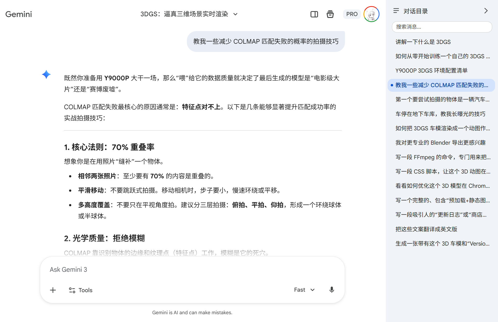
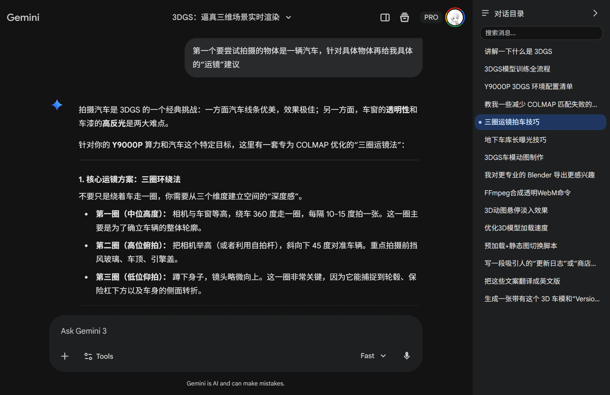
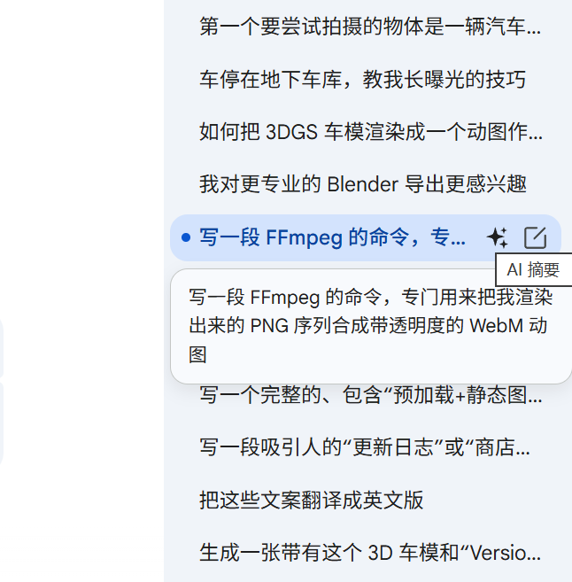
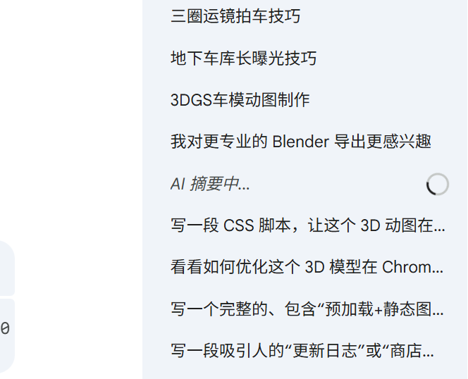

# Navigator for Gemini

一款支持 Chrome / Firefox 的浏览器扩展，为 Google Gemini 对话页面添加侧边栏目录导航。用户可以通过目录快速跳转到任意对话位置，无需反复滚动页面查找历史消息，尤其适合进行长对话和递归式提问的用户。









## 功能

- **对话目录** — 自动扫描当前对话中的所有问答轮次，生成侧边目录列表
- **快速跳转** — 点击目录项即可平滑滚动到对应的对话位置
- **搜索过滤** — 支持在目录中按关键词搜索，快速定位目标消息
- **自定义重命名** — 可对任意目录项手动重命名，方便标记重要对话
- **滚动追踪** — 目录自动高亮当前正在浏览的对话位置
- **面板折叠** — 支持展开/收起侧边栏，折叠状态自动记忆
- **深色模式** — 自动适配 Gemini 的 light/dark 主题
- **SPA 路由适配** — 切换对话时自动刷新目录内容

## 安装

### Chrome

1. 下载或克隆本仓库到本地
2. 打开 Chrome 浏览器，进入 `chrome://extensions/`
3. 开启右上角的「开发者模式」
4. 点击「加载已解压的扩展程序」，选择本项目文件夹
5. 访问 [gemini.google.com](https://gemini.google.com/)，页面右侧将出现对话目录面板

### Firefox（PC 本地导入）

1. 下载或克隆本仓库到本地
2. 打开 Firefox，访问 `about:debugging#/runtime/this-firefox`
3. 点击「临时载入附加组件（Load Temporary Add-on）」
4. 选择项目中的 `manifest.json` 文件
5. 访问 [gemini.google.com](https://gemini.google.com/)，页面右侧将出现对话目录面板

> 说明：临时载入模式在 Firefox 重启后会失效，重启后需要重新导入。

## 使用方法

- **浏览目录**：打开任意 Gemini 对话，右侧面板自动生成对话目录
- **跳转**：点击目录中的任意条目，页面将滚动到对应位置
- **搜索**：在顶部搜索框输入关键词过滤目录项
- **重命名**：鼠标悬停在目录项上，点击重命名图标进行编辑，按 Enter 确认，Esc 取消
- **折叠面板**：点击面板顶部的隐藏按钮折叠侧边栏，点击顶栏中的展开按钮恢复

## 项目结构

```
├── manifest.json          # 扩展清单（Manifest V3，含 Firefox gecko 配置）
├── content.js             # 内容脚本（目录面板核心逻辑）
├── styles.css             # 面板样式
└── icons/                 # 图标资源
```